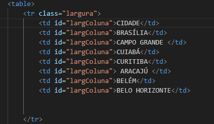
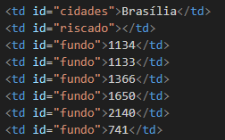
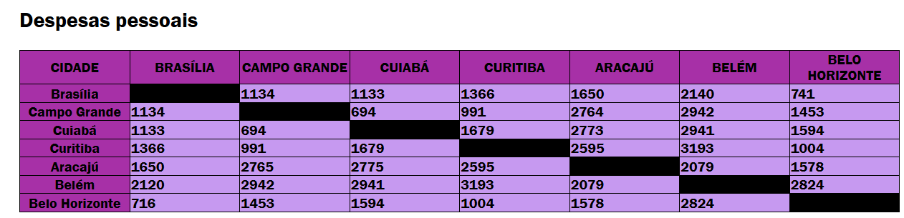

# Projeto - Tabela de distâncias entre capitais brasileiras

Projeto variado como parte avaliativa de discipina de Fundamentos de Deenvolvimentos ministrada pelo professor Leonardo Rocha

## índice
*[Descrição](#descrição)
*[Tecnologias](#tecnologias)
*[Referência](#rêferências)
*[Autor(a)](#autora)

## Descrição

Esse projeto consiste na construção de uma tabela que contempla capitais brasileiras. Nessa tabela está a distância entre essas capitais. 

* Aracajú
* Belém
* Belo Horizonte
* Brasília
* Campo Grande
* Cuiabá
* Curitiba

## Resultado do projeto

#### tabela

* table -  representa dados tabulares 
* tr - linhas da tabela

Veja uma imagem da parte do código, onde é possível indentificar uso dos elementos mencionados acima:



* td - significa *dados da tabela



A seguir você vera a imagem do resultado final do projeto



### Estilização

O projeto foi estilizado, utilizando CSS3. Foi criado um arquivo chamado main.css. Nesse arquivo, constam configurações de estilo apresentadas a seguir:

* Estilo de cores - A cor de fundo utilizada no projeyo foi definida como segue:

``` 
cidades {
     background-color: rgb(167, 48, 167);
    text-align: center;
}
```


## Tecnologias

* HTML5
* CSS3
* GIT
* Github
* READE

## Rêferências
[Alura](https:www.alura.com.br/artigos/escrever-bom-readme) - Como escrever um README incrível no seu Github

## Autor(a)
O projeto foi desenvolvido por:

* Isabella Fontana
* Kiara Messias
* Rafaela Araujo
* Vitor Eduardo
* Caio Lovison
* Miguel Gonçalves


